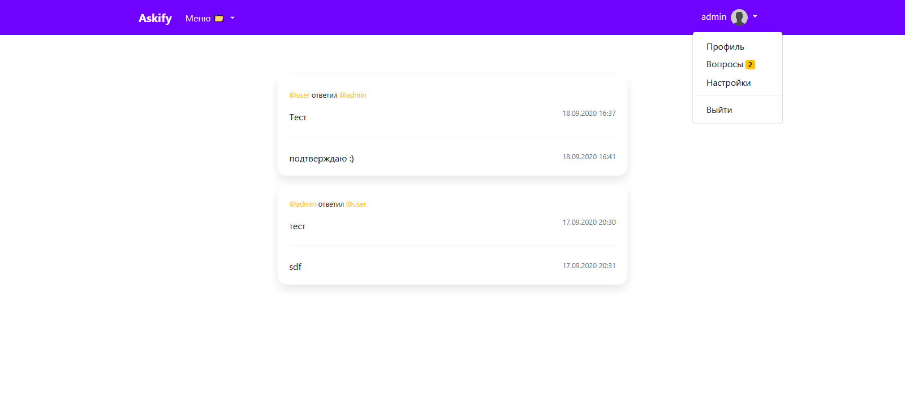
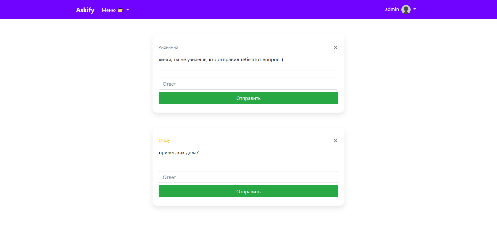
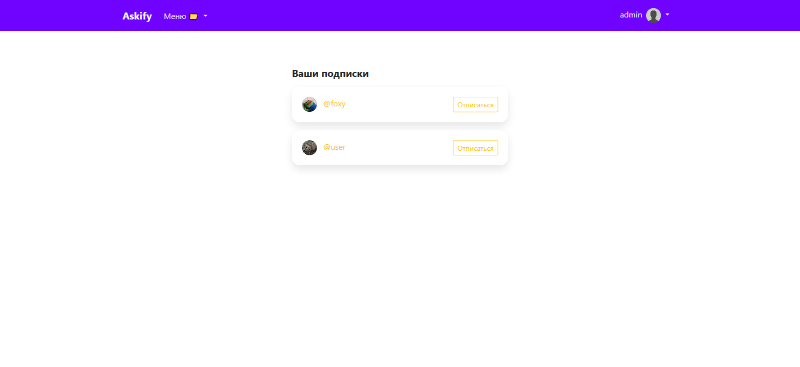

<h1 align="center">Askify</h1>

------

## Описание

Сервис, позволяюший пользователям задавать пользователям вопросы, в том числе анонимно.

## Канбан доска проекта

## Функционал

* Лента вопросов
* Подписки
* Информация о пользователе
  1. Имя, фамилия
  2. Местоположение
  3. Instagram
  4. Telegram
  5. Bio
* Настройки
* Вопросы
  1. Удаление
  2. Ответ
  3. Отправка
      1. Анонимно
      2. От пользователя

## Скриншоты

